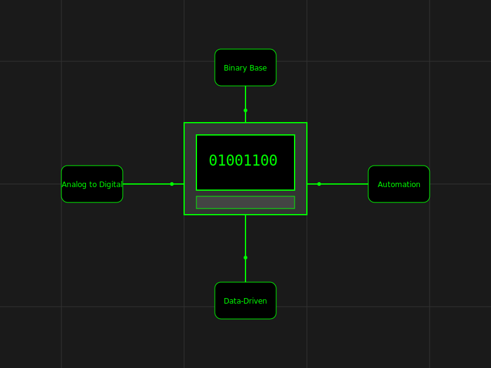
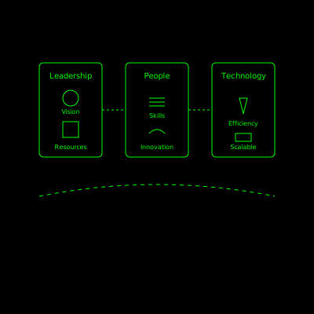

# Going Greener
## Transforming Organizations for Sustainability Beyond Just Technology

  
    Sustainable Digital Transformation Journey
  

---
layout: section
---

# Introduction

Who am I?
 - Apaichon Punopas
 - 20 years in IT software development
 - Currently working at Arise by Infinitas
 - Associate Director of Technology
 - Arise by Infinitas is a part of the Krungthai Bank and Accenture Group
 - Ex President of Thai Programmer Association
 - Dev Mountain Tech Festival Founder
 - Digital Transformation with IT Technology for Corporate Consultant

    <!-- Replace with your image URL -->

 

---
layout: section
---

# Understanding Digital Transformation

---
layout: two-cols
---

# The Fundamentals

::right::

<v-clicks style="margin-top: 150px;">

- Everything starts with Binary (0,1)
- The language of computers
- Converts analog to digital
- Enables automation
- Powers data-driven decisions

</v-clicks>

---
layout: two-cols
---
# Why Transform?

::right::

<v-clicks style="margin-top: 150px;">

- Market Competition
- Business Growth
- Operational Efficiency
- Customer Experience
- Data Insights
- Scalability

</v-clicks>
---
layout: quote
---

# Success Stories

## Amazon
- From bookstore to tech giant
- Cloud leadership
- Digital innovation

## Netflix
- DVD rental to streaming
- Content creation
- Personalization

## Agoda
- Travel revolution
- Digital-first booking
- Global reach

---
layout: section
---

# The Sustainability Challenge

---
layout: default
---

# Understanding Long-Term Sustainability

<v-clicks>

- Beyond quarterly results
- Environmental impact
- Social responsibility
- Economic viability
- Organizational culture

</v-clicks>

<v-click>

*Sustainability is more challenging than short or medium-term goals*

</v-click>

---
layout: two-cols
---

# Global Challenges

<v-clicks>

- Digital Power Consumption
  - Data centers: 1% global electricity
  - AI training: 300,000x increase
  - Cloud: 15-20% annual growth

- Carbon Credits Reality
  - Not a complete solution
  - Need actual reduction

* Find information from (IEA), NeurIPS, ICML, Gartner, IDC, or McKinsey

</v-clicks>

::right::

# Organizational Challenges

<v-clicks>

- Digital Literacy Gap
  - Skill variations
  - Change resistance
  - Training needs

- Process Transformation
  - Legacy systems
  - Paper dependency
  - Integration issues

</v-clicks>

---
layout: section
---

# Arise's Journey

---
layout: default
---

# Current Initiatives

## Talent Development
<v-clicks>

- Software Development Academy
- Incubator Program
- Bi-weekly Training
- Technical Workshops

</v-clicks>

## Environmental Impact
<v-clicks>

- Paperless Operations
- Energy-efficient Tech Stack
- Go Language Adoption
- Green Infrastructure

</v-clicks>

---
layout: section
---

# My Opinion for Sustainable Transformation

---
layout: default
---

---
layout: default
class: text-center
---

# Social Responsibility

<!-- 

## Environmental
<v-clicks>

- Tree Planting
- Carbon Reduction
- Green Initiatives

</v-clicks>

## Community
<v-clicks>

- Social Programs
- Education Support
- Local Engagement

</v-clicks>

## Impact
<v-clicks>

- Measurable Results
- Long-term Benefits
- Sustainable Growth

</v-clicks>

-->

---
layout: section
---

# Key Success Factors

---
layout: default
---

# Success Elements

## Leadership
<v-clicks>

- Long-term Vision
- Resource Allocation
- Cultural Change

</v-clicks>

## People
<v-clicks>

- Skill Development
- Innovation Culture
- Digital Literacy

</v-clicks>

## Technology
<v-clicks>

- Energy Efficiency
- Scalable Solutions
- Green Tech

</v-clicks>

---
layout: default
---

# Key Success Factors

---
layout: center
class: text-center
---

# Conclusion

<v-clicks>

- Digital transformation and sustainability are inseparable
- Balance technology with environmental responsibility
- Focus on people development
- Create lasting positive impact
- Build a better future together

</v-clicks>

---
layout: end
---

# Thank You

Contact for more information

apaichon@gmail.com